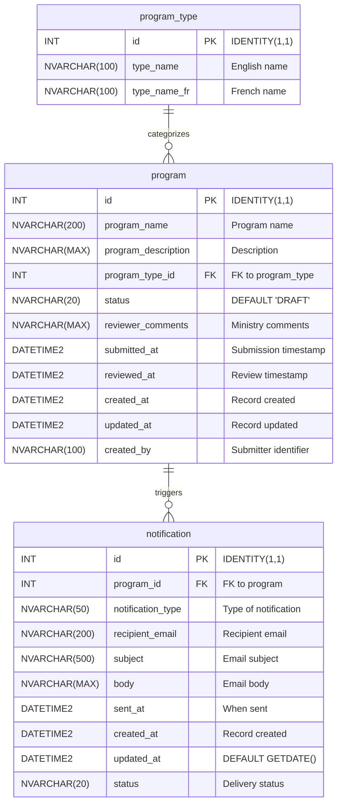

<!-- markdownlint-disable-file -->
# Task Research: Demo Scaffolding

Comprehensive research for all scaffolding files needed to support the 130-minute OPS Developer Day 2026 demo — a live GitHub Copilot session that builds a full-stack Program Approval web application from scratch for the Ontario Public Sector.

## Task Implementation Requests

* Research and specify all 13 scaffolding files (7 configuration + 3 documentation + 2 scripts + 1 talk track)
* Produce implementation-ready detail so `/task-plan` can create a file-by-file plan without further clarification
* Cover configuration layer, documentation layer, and operational layer completely

## Scope and Success Criteria

* Scope: All scaffolding files generated during the live demo. Does NOT include application code (backend, frontend, database migrations, tests, CI/CD pipelines) — those are built during the demo itself.
* Assumptions:
  * Only `README.md` and `.github/prompts/bootstrap-demo.prompt.md` exist when the demo begins
  * No ADO work items exist — all must be created via MCP during Act 1
  * Azure resources are pre-deployed in resource group `rg-dev-125`
  * ADO organization is `MngEnvMCAP675646`, project is `ProgramDemo-DevDay2026-DryRun1`
* Success Criteria:
  * Every scaffolding file has a complete content specification — no TODOs or placeholders
  * Each instruction file has proper YAML frontmatter with `description` and `applyTo`
  * Documentation specs include full Mermaid diagram content
  * Talk track covers all 130 minutes with no time gaps
  * Research document is self-sufficient for `/task-plan` handoff

## Outline

1. Copilot Instructions Specification
2. MCP Configuration
3. ADO Work Item Creation Plan
4. Documentation Specifications (Architecture, Data Dictionary, Design Document)
5. Talk Track Specification
6. Local Development Scripts
7. .gitignore Specification
8. Out of Scope
9. Technical Scenarios

## Potential Next Research

* Talk track timing validation — verify all minute ranges sum to 130 and no gaps exist
  * Reasoning: Timing errors in a live demo cause visible problems
  * Reference: bootstrap-demo.prompt.md Talk Track Structure section
* Ontario Design System CSS class names — verify current component names for Header, Footer, LanguageToggle
  * Reasoning: Ontario DS evolves; class names may have changed
  * Reference: https://designsystem.ontario.ca/

## Research Executed

### File Analysis

* `README.md` (Lines 1–170)
  * Business problem: citizens submit program requests → ministry reviews → notification sent
  * Tech stack: React front end, Java API back end, Azure SQL, Azure Durable Functions, App Services, Logic Apps, AI Foundry
  * Bilingual EN/FR, Ontario Design System, WCAG 2.2
  * CI/CD: GitHub Actions, GitHub Advanced Security (Dependabot, Secret Scanning)
  * Project management: Azure DevOps (User Stories, Test Plans)
  * Application screens: Public Portal (submit program), Internal Portal (review programs), Search
  * Live Change Demo: add a new field end-to-end (data model → UI → queries → tests → accessibility → translations → docs)
  * Lessons learned sections provide additional technical context on H2, MCP, .gitignore, instructions, containerization

* `.github/prompts/bootstrap-demo.prompt.md` (Lines 1–215)
  * Complete 130-minute talk track structure with 8 acts plus opening and closing
  * Full database schema for 3 tables with all columns and types
  * 5 API endpoints defined
  * Frontend component hierarchy
  * ADO work item hierarchy (Epic → 8 Features → Stories)
  * Talk track formatting requirements
  * Out of scope items
  * All critical technical details not in README.md

### Project Conventions

* Standards referenced: Ontario Design System, WCAG 2.2 Level AA, RFC 7807 (Problem Detail)
* Instructions followed: HVE-Core task-researcher workflow, `.github/copilot-instructions.md` (to be created as part of scaffolding)

---

## Key Discoveries

### Project Structure

The repository starts with only `README.md` and `.github/prompts/bootstrap-demo.prompt.md`. All scaffolding must be generated during the demo. The target file structure after scaffolding:

```text
.
├── .github/
│   ├── copilot-instructions.md
│   ├── instructions/
│   │   ├── ado-workflow.instructions.md
│   │   ├── java.instructions.md
│   │   ├── react.instructions.md
│   │   └── sql.instructions.md
│   └── prompts/
│       ├── bootstrap-demo.prompt.md          (already exists)
│       ├── demo-scaffolding.prompt.md        (already exists)
│       ├── demo-scaffolding-plan.prompt.md   (already exists)
│       └── demo-scaffolding-implement.prompt.md (already exists)
├── .vscode/
│   └── mcp.json
├── docs/
│   ├── architecture.md
│   ├── data-dictionary.md
│   └── design-document.md
├── scripts/
│   ├── Start-Local.ps1
│   └── Stop-Local.ps1
├── .gitignore
├── README.md                                 (already exists)
└── TALK-TRACK.md
```

### Implementation Patterns

* **Instruction files** use YAML frontmatter with `description` and `applyTo` glob patterns
* **Commit format**: `AB#{id} descriptive message` linking to ADO work items
* **Branch format**: `feature/{id}-description` for feature branches
* **PR linking**: `Fixes AB#{id}` to auto-close ADO work items
* **Mermaid diagrams** used for architecture (C4/flowchart) and data dictionary (ER)

---

## 1. Copilot Instructions Specification

### Global Instructions: `.github/copilot-instructions.md`

No YAML frontmatter required (global instructions apply everywhere).

**Content specification:**

* Project name: OPS Program Approval System
* Project description: Full-stack web application for Ontario citizens to submit program requests and Ministry employees to review them
* Tech stack summary: React 18 + TypeScript (frontend), Java 21 + Spring Boot 3.x (backend), Azure SQL (database), Azure App Services (hosting)
* Bilingual requirement: All user-facing text in English and French using i18next
* Accessibility: WCAG 2.2 Level AA compliance on all screens
* UI framework: Ontario Design System (https://designsystem.ontario.ca/)
* Commit message format: `AB#{id} descriptive message`
* Branch naming: `feature/{id}-description`
* PR body: Include `Fixes AB#{id}` to auto-close ADO work items
* Azure DevOps: Organization `MngEnvMCAP675646`, Project `ProgramDemo-DevDay2026-DryRun1`
* Azure: Resource group `rg-dev-125`
* Repository structure: `backend/` for Java API, `frontend/` for React app, `database/` for Flyway migrations

### Instruction Files Table

| File | `description` | `applyTo` | Key Conventions |
|------|---------------|-----------|-----------------|
| `ado-workflow.instructions.md` | ADO branching, commit, and PR workflow conventions | `**` | Branch: `feature/{id}-description`; Commit: `AB#{id} message`; PR: `Fixes AB#{id}`; post-merge: delete branch, move story to Done |
| `java.instructions.md` | Java 21 and Spring Boot 3.x coding conventions | `backend/**` | Spring Boot 3.x, Spring Data JPA, constructor injection (no `@Autowired`), `@Valid` + Bean Validation, `ResponseEntity`, `ProblemDetail` (RFC 7807), Flyway migrations, H2 local profile `MODE=MSSQLServer`, package `com.ontario.program`, Maven wrapper |
| `react.instructions.md` | React 18, TypeScript, and Vite frontend conventions | `frontend/**` | React 18 + TypeScript, Vite (`server.port: 3000`), functional components with hooks, i18next for EN/FR, Ontario DS CSS classes, WCAG 2.2 Level AA (`aria-*`, semantic HTML, keyboard nav, `lang` attribute), `react-router-dom` v6, axios for API calls, `frontend/src/` structure |
| `sql.instructions.md` | Azure SQL and Flyway migration conventions | `database/**` | Azure SQL target, Flyway versioned migrations `V001__description.sql`, `NVARCHAR` for bilingual text, `IF NOT EXISTS` guards on DDL, `INT IDENTITY(1,1)` PKs, `DATETIME2` timestamps, seed data via `INSERT ... WHERE NOT EXISTS` (never MERGE), audit columns `created_at`, `updated_at` |

### Instruction File Content Details

#### `ado-workflow.instructions.md`

```yaml
---
description: "ADO branching, commit, and PR workflow conventions"
applyTo: "**"
---
```

Rules to encode:
* Create a feature branch from `main` for each user story: `feature/{id}-description`
* Commit messages must start with the ADO work item ID: `AB#{id} descriptive message`
* Every PR body must include `Fixes AB#{id}` to auto-transition the linked work item
* After PR merge, delete the feature branch
* Move the ADO work item to Done after merge
* Keep commits atomic — one logical change per commit
* Squash merge PRs to keep `main` history clean

#### `java.instructions.md`

```yaml
---
description: "Java 21 and Spring Boot 3.x coding conventions"
applyTo: "backend/**"
---
```

Rules to encode:
* Java 21 LTS, Spring Boot 3.x, Maven wrapper (`./mvnw`)
* Package structure: `com.ontario.program` with sub-packages `controller`, `service`, `repository`, `model`, `dto`, `config`, `exception`
* Constructor injection only — never use `@Autowired` on fields
* Request validation: `@Valid` on controller method parameters + Bean Validation annotations (`@NotBlank`, `@NotNull`, `@Size`) on DTOs
* Return `ResponseEntity<T>` from all controller methods
* Error responses: `ProblemDetail` (RFC 7807) via `@ControllerAdvice` + `@ExceptionHandler`
* Database: Spring Data JPA with Flyway migrations
* Local profile (`application-local.yml`): H2 in-memory database with `MODE=MSSQLServer;DATABASE_TO_LOWER=TRUE`
* Production profile: Azure SQL connection via environment variables
* Server port: 8080 (`server.port=8080`)
* API base path: `/api`
* Testing: JUnit 5, MockMvc for controller tests, `@DataJpaTest` for repository tests

#### `react.instructions.md`

```yaml
---
description: "React 18, TypeScript, and Vite frontend conventions"
applyTo: "frontend/**"
---
```

Rules to encode:
* React 18.x with TypeScript (strict mode)
* Vite build tool — `vite.config.ts` must set `server.port: 3000` and `server.proxy` for `/api` → `http://localhost:8080`
* Functional components with hooks only — no class components
* State management: React hooks (`useState`, `useEffect`, `useContext`) — no Redux
* Routing: `react-router-dom` v6 with `<BrowserRouter>`
* HTTP client: axios with a shared instance configured with base URL
* Internationalization: `i18next` + `react-i18next` with EN and FR translation JSON files
* UI: Ontario Design System CSS classes (https://designsystem.ontario.ca/)
* Accessibility: WCAG 2.2 Level AA — `aria-*` attributes, semantic HTML (`<main>`, `<nav>`, `<header>`, `<footer>`, `<form>`), keyboard navigation, `lang` attribute on `<html>`
* Component structure: `frontend/src/components/` for shared components, `frontend/src/pages/` for route pages
* Testing: Vitest + React Testing Library
* Linting: ESLint with TypeScript rules

#### `sql.instructions.md`

```yaml
---
description: "Azure SQL and Flyway migration conventions"
applyTo: "database/**"
---
```

Rules to encode:
* Target database: Azure SQL (PaaS)
* Migration tool: Flyway (integrated with Spring Boot)
* Migration naming: `V001__create_program_type_table.sql`, `V002__create_program_table.sql`, etc.
* Migration location: `database/migrations/` (symlinked or copied to `backend/src/main/resources/db/migration/`)
* String columns: `NVARCHAR` for all text (bilingual support)
* Primary keys: `INT IDENTITY(1,1)` — never use `BIGINT` or UUIDs for this project
* Timestamps: `DATETIME2` — never use `DATETIME` or `TIMESTAMP`
* DDL guards: `IF NOT EXISTS` on all CREATE TABLE and ALTER TABLE statements
* Seed data: `INSERT ... WHERE NOT EXISTS (SELECT 1 FROM table WHERE condition)` — never use `MERGE`
* Audit columns: `created_at DATETIME2`, `updated_at DATETIME2` on transactional tables; `created_by NVARCHAR(100)` where user-initiated
* Foreign keys: use explicit `CONSTRAINT` names following pattern `FK_child_parent`
* Indexes: add indexes on frequently queried columns (e.g., `status`, `program_type_id`)

---

## 2. MCP Configuration

### `.vscode/mcp.json`

Full content specification:

```json
{
  "servers": {
    "ado": {
      "type": "stdio",
      "command": "npx",
      "args": [
        "-y",
        "azure-devops-mcp",
        "--organization",
        "MngEnvMCAP675646",
        "--project",
        "ProgramDemo-DevDay2026-DryRun1"
      ]
    }
  }
}
```

Key details:
* Uses `npx -y` to auto-install without prompts
* Package: `azure-devops-mcp` — the Azure DevOps MCP server for VS Code
* Organization: `MngEnvMCAP675646`
* Project: `ProgramDemo-DevDay2026-DryRun1`
* Type: `stdio` — communicates via standard input/output
* This configuration enables Copilot to create/read/update ADO work items, query boards, and manage test plans directly from the editor

---

## 3. ADO Work Item Creation Plan

**No work items exist when the demo begins.** All must be created via MCP during Act 1 (Minutes 8–20).

### Hierarchy

```text
Epic: OPS Program Approval System
├── Feature: Infrastructure Setup
│   └── (pre-deployed in rg-dev-125 — close immediately after creation)
├── Feature: Database Layer
│   ├── Story: Create program_type lookup table
│   ├── Story: Create program table
│   ├── Story: Create notification table
│   └── Story: Seed program_type reference data
├── Feature: Backend API
│   ├── Story: Spring Boot project scaffolding
│   ├── Story: POST /api/programs — submit endpoint
│   ├── Story: GET /api/programs and GET /api/programs/{id} — list and get endpoints
│   ├── Story: PUT /api/programs/{id}/review — review endpoint
│   └── Story: GET /api/program-types — program types endpoint
├── Feature: Citizen Portal
│   ├── Story: React + Vite project scaffolding
│   ├── Story: Ontario DS layout (Header, Footer, LanguageToggle)
│   ├── Story: Program submission form
│   ├── Story: Submission confirmation page
│   ├── Story: Program search page
│   └── Story: Bilingual EN/FR with i18next
├── Feature: Ministry Portal
│   ├── Story: Review dashboard page
│   ├── Story: Review detail page
│   └── Story: Approve/reject actions
├── Feature: Quality Assurance
│   ├── Story: Backend controller tests (MockMvc)
│   ├── Story: Frontend component tests (Vitest + RTL)
│   ├── Story: Accessibility tests (WCAG 2.2 audit)
│   └── Story: Bilingual verification (EN/FR completeness)
├── Feature: CI/CD Pipeline
│   ├── Story: GitHub Actions CI workflow
│   ├── Story: Dependabot configuration
│   └── Story: Secret scanning enablement
└── Feature: Live Change Demo
    ├── Story: Add program_budget field end-to-end
    └── Story: Update tests for new budget field
```

### Creation Order During Act 1

1. Create Epic: "OPS Program Approval System"
2. Create all 8 Features under the Epic
3. Create Stories under each Feature
4. Immediately close the "Infrastructure Setup" Feature (resources pre-deployed)
5. Show the populated ADO board to the audience

### Work Item Naming Convention

* Epic: descriptive system name
* Features: functional area name
* Stories: action-oriented (`Create...`, `Add...`, `Implement...`) with enough detail for a developer to understand scope

---

## 4. Documentation Specifications

### 4.1 Architecture: `docs/architecture.md`

**Content specification:**

Title: "Architecture Overview"

Mermaid diagram type: `flowchart TD` (top-down)

Diagram elements:
* `Browser[Browser / Client]` — external user
* `ReactApp[React App<br/>Azure App Service<br/>Port 3000]` — frontend hosted on App Service
* `JavaAPI[Java API<br/>Azure App Service<br/>Port 8080]` — backend hosted on App Service
* `AzureSQL[(Azure SQL<br/>Database)]` — database
* `DurableFunctions[Azure Durable Functions<br/>Workflow Orchestration]` — future orchestration
* `LogicApps[Azure Logic Apps<br/>Email Notifications]` — notification delivery
* `AIFoundry[Azure AI Foundry<br/>Mini Model]` — AI capabilities

Connections:
* Browser → ReactApp: "HTTPS"
* ReactApp → JavaAPI: "REST API /api/*"
* JavaAPI → AzureSQL: "JDBC / Spring Data JPA"
* JavaAPI → DurableFunctions: "HTTP Trigger (future)"
* DurableFunctions → LogicApps: "Orchestration (future)"
* LogicApps → Browser: "Email Notification (future)"
* JavaAPI → AIFoundry: "AI Processing (future)"

Subgraphs:
* `subgraph Azure["Azure Resource Group: rg-dev-125"]` containing ReactApp, JavaAPI, AzureSQL, DurableFunctions, LogicApps, AIFoundry

Prose sections:
* **Overview** — brief description of the 3-tier architecture
* **Component Descriptions** — table with each component, technology, and responsibility
* **Data Flow** — numbered steps: (1) citizen submits form → (2) React sends POST to API → (3) API validates and persists to Azure SQL → (4) ministry reviews via internal portal → (5) API updates status → (6) notification triggered
* **Security** — RBAC authentication (listed in README.md tech stack; shown in architecture prose as a future integration alongside Durable Functions and Logic Apps)
* **Future Integrations** — Durable Functions, Logic Apps, AI Foundry, RBAC authentication (shown in diagram but not implemented in this demo)
* **Infrastructure** — all resources in `rg-dev-125`, pre-deployed before the demo

### 4.2 Data Dictionary: `docs/data-dictionary.md`

**Content specification:**

Title: "Data Dictionary"

Mermaid diagram type: `erDiagram`



Table details sections — for each table:
* Table purpose
* Column table with: Column Name, Data Type, Constraints, Description
* Relationships (FK references)

**Seed Data section:**

| id | type_name | type_name_fr |
|----|-----------|--------------|
| 1 | Community Services | Services communautaires |
| 2 | Health & Wellness | Santé et bien-être |
| 3 | Education & Training | Éducation et formation |
| 4 | Environment & Conservation | Environnement et conservation |
| 5 | Economic Development | Développement économique |

**Status values:**
* `DRAFT` — initial state after citizen submission
* `SUBMITTED` — citizen has finalized the submission (design enhancement: enables two-step submit flow where the citizen can save a draft before submitting)
* `APPROVED` — ministry has approved
* `REJECTED` — ministry has rejected

**Migration plan:**
* `V001__create_program_type_table.sql`
* `V002__create_program_table.sql`
* `V003__create_notification_table.sql`
* `V004__seed_program_types.sql`

### 4.3 Design Document: `docs/design-document.md`

**Content specification:**

Title: "Design Document"

#### API Endpoints

| # | Method | Path | Description | Request Body | Response |
|---|--------|------|-------------|-------------|----------|
| 1 | POST | `/api/programs` | Submit a new program | `ProgramSubmitRequest` | `201 Created` + `ProgramResponse` |
| 2 | GET | `/api/programs` | List all programs | — | `200 OK` + `List<ProgramResponse>` |
| 3 | GET | `/api/programs/{id}` | Get single program | — | `200 OK` + `ProgramResponse` or `404` |
| 4 | PUT | `/api/programs/{id}/review` | Approve or reject | `ProgramReviewRequest` | `200 OK` + `ProgramResponse` or `404` |
| 5 | GET | `/api/program-types` | List program types | — | `200 OK` + `List<ProgramTypeResponse>` |

#### Request DTOs

**`ProgramSubmitRequest`:**

| Field | Type | Validation | Description |
|-------|------|------------|-------------|
| `programName` | `String` | `@NotBlank`, `@Size(max=200)` | Program name |
| `programDescription` | `String` | `@NotBlank` | Program description |
| `programTypeId` | `Integer` | `@NotNull` | FK to program_type |
| `createdBy` | `String` | `@NotBlank`, `@Size(max=100)` | Submitter identifier |

**`ProgramReviewRequest`:**

| Field | Type | Validation | Description |
|-------|------|------------|-------------|
| `status` | `String` | `@NotBlank`, `@Pattern(regexp="APPROVED\|REJECTED")` | Decision |
| `reviewerComments` | `String` | `@Size(max=4000)` | Optional reviewer notes |

#### Response DTOs

**`ProgramResponse`:**

| Field | Type | Description |
|-------|------|-------------|
| `id` | `Integer` | Program ID |
| `programName` | `String` | Program name |
| `programDescription` | `String` | Description |
| `programTypeId` | `Integer` | FK to program_type |
| `programTypeName` | `String` | Resolved type name (EN) |
| `programTypeNameFr` | `String` | Resolved type name (FR) |
| `status` | `String` | Current status |
| `reviewerComments` | `String` | Ministry comments |
| `submittedAt` | `String` (ISO 8601) | Submission timestamp |
| `reviewedAt` | `String` (ISO 8601) | Review timestamp |
| `createdAt` | `String` (ISO 8601) | Record created |
| `updatedAt` | `String` (ISO 8601) | Record updated |
| `createdBy` | `String` | Submitter identifier |

**`ProgramTypeResponse`:**

| Field | Type | Description |
|-------|------|-------------|
| `id` | `Integer` | Program type ID |
| `typeName` | `String` | English name |
| `typeNameFr` | `String` | French name |

#### Error Handling

All errors use RFC 7807 `ProblemDetail` format:

```json
{
  "type": "about:blank",
  "title": "Bad Request",
  "status": 400,
  "detail": "programName: must not be blank",
  "instance": "/api/programs"
}
```

Error scenarios:
* `400 Bad Request` — validation failures (Bean Validation errors)
* `404 Not Found` — program or program type not found
* `500 Internal Server Error` — unexpected server errors

#### Frontend Component Hierarchy

```text
App
├── Layout
│   ├── Header (Ontario DS header with logo and nav)
│   ├── LanguageToggle (EN/FR switch using i18next)
│   └── Footer (Ontario DS footer)
├── Pages
│   ├── SubmitProgram (form: program name, description, type dropdown)
│   ├── SubmitConfirmation (success message with program details)
│   ├── SearchPrograms (search by name, results table)
│   ├── ReviewDashboard (table of submitted programs for ministry)
│   └── ReviewDetail (program details + approve/reject buttons + comments)
└── Shared
    ├── LoadingSpinner
    ├── ErrorAlert
    └── ProgramCard
```

Route mapping:
* `/` → SubmitProgram
* `/confirmation/:id` → SubmitConfirmation
* `/search` → SearchPrograms
* `/review` → ReviewDashboard
* `/review/:id` → ReviewDetail

---

## 5. Talk Track Specification

### `TALK-TRACK.md` — Repository Root

**File placement**: `TALK-TRACK.md` at the repository root (NOT in `docs/`).

**Duration**: 130 minutes total (Part 1: 0–70, Part 2: 70–130)

### Talk Track Structure

#### Part 1: "Building From Zero" (Minutes 0–70)

**Opening (Minutes 0–8) — Role: Presenter**

Content:
* Welcome and introduction to Developer Day 2026
* The business problem: OPS needs a Program Approval system
* Show the empty repository (only README.md + bootstrap-demo.prompt.md)
* Show Azure portal — resource group `rg-dev-125` with pre-deployed resources
* Show empty ADO board — no Epic, no Features, no Stories
* Set the challenge: "Can we build this entire application in one session using GitHub Copilot?"

**Act 1: The Architect (Minutes 8–20) — Role: Architect**

Content:
* Run `bootstrap-demo.prompt.md` to generate the 3 scaffolding prompts
* Run `demo-scaffolding.prompt.md` → research document
* Run `demo-scaffolding-plan.prompt.md` → implementation plan
* Run `demo-scaffolding-implement.prompt.md` → generate all config, docs, scripts
* Configure MCP by opening `.vscode/mcp.json`
* Create ADO work items via MCP: Epic → Features → Stories (full hierarchy)
* Show populated ADO board
* Commit checkpoint: v0.1.0

**Act 2: The DBA (Minutes 20–32) — Role: DBA**

Content:
* Pick up Database Layer stories from ADO board
* Create 4 Flyway migrations:
  * `V001__create_program_type_table.sql`
  * `V002__create_program_table.sql`
  * `V003__create_notification_table.sql`
  * `V004__seed_program_types.sql`
* Show H2 console with `MODE=MSSQLServer`
* Commit checkpoint: v0.2.0

**Act 3: The Backend Developer (Minutes 32–52) — Role: Backend Dev**

Content:
* Pick up Backend API stories from ADO board
* Generate Spring Boot scaffolding (Maven, Java 21, dependencies)
* Implement 5 API endpoints:
  1. `POST /api/programs`
  2. `GET /api/programs`
  3. `GET /api/programs/{id}`
  4. `PUT /api/programs/{id}/review`
  5. `GET /api/program-types`
* Live curl tests against running backend
* Commit checkpoint: v0.3.0

**Act 4: The Frontend Developer (Minutes 52–70) — Role: Frontend Dev**

Content:
* Pick up Citizen Portal stories from ADO board
* Generate React + Vite + TypeScript scaffolding
* Apply Ontario Design System layout (Header, Footer, LanguageToggle)
* Build SubmitProgram form with program type dropdown
* Build SubmitConfirmation page
* Build SearchPrograms page
* Add bilingual EN/FR with i18next
* Live form submission against running backend
* Commit checkpoint: v0.4.0

**Cliffhanger (Minute 70)**

* Show the working citizen portal — form submission works end-to-end
* Navigate to `/review` — empty dashboard, no review capability
* Show ADO board — Ministry Portal stories are all "New" (unstarted)
* "Citizens can submit... but nobody can approve. See you after the break."

#### Part 2: "Closing the Loop" (Minutes 70–130)

**Recap (Minutes 70–73) — Role: Presenter**

Content:
* Quick recap of Part 1 achievements
* Show database with submitted programs
* Show ADO board progress

**Act 5: Completing the Story (Minutes 73–87) — Role: Frontend Dev**

Content:
* Pick up Ministry Portal stories from ADO board
* Build ReviewDashboard page (table of submitted programs)
* Build ReviewDetail page (program details + approve/reject)
* Wire approve/reject to `PUT /api/programs/{id}/review`
* Live demo: approve a submitted program
* Commit checkpoint: v0.5.0

**Act 6: The QA Engineer (Minutes 87–100) — Role: QA**

Content:
* Pick up Quality Assurance stories from ADO board
* Backend controller tests (MockMvc for all 5 endpoints)
* Frontend component tests (Vitest + React Testing Library)
* Accessibility tests (WCAG 2.2 Level AA audit)
* Bilingual verification (EN/FR translation completeness)
* Run all tests — show green results
* Commit checkpoint: v0.6.0

**Act 7: The DevOps Engineer (Minutes 100–107) — Role: DevOps**

Content:
* Pick up CI/CD Pipeline stories from ADO board
* Create GitHub Actions CI workflow (build + test on PR)
* Configure Dependabot for Maven and npm
* Enable secret scanning
* Show GHAS security tab
* Commit checkpoint: v0.7.0

**Act 8: The Full Stack Change (Minutes 107–120) — Role: Full Stack**

Content:
* Pick up Live Change Demo stories from ADO board
* Add `program_budget` field end-to-end:
  1. New migration: `V005__add_program_budget.sql` — `ALTER TABLE program ADD program_budget DECIMAL(15,2)`
  2. Update JPA entity with `programBudget` field
  3. Update DTOs (request + response)
  4. Update API endpoints (submit, review, get)
  5. Update React form with budget input field
  6. Update tests for the new field
  7. Add FR translation for budget label
  8. Update data dictionary and design document
* Live demo: submit a program with budget, approve it
* Commit checkpoint: v0.8.0

**Closing (Minutes 120–130) — Role: Presenter**

Content:
* Summary of everything built
* Key numbers summary table
* Show ADO board — all stories Done
* Final commit: v1.0.0
* Q&A

### Talk Track Formatting Rules

All formatting conventions for the `TALK-TRACK.md` file:

* **Scripted dialogue** in blockquotes: `> "Welcome to Developer Day 2026..."`
* **Demo actions** as bullet lists with minute markers: `* **[Minute 12]** Open VS Code and run the scaffolding prompt`
* **Key beat** callouts: `**Key beat:** This is where Copilot generates the entire database schema from the data dictionary.`
* **Audience engagement point** callouts: `**Audience engagement point:** Ask the audience — "How long would this normally take your team?"`
* **Commit checkpoints** at the end of each act in a table:

| Tag | Phase | Description |
|-----|-------|-------------|
| v0.1.0 | Scaffolding | Config, docs, scripts, ADO board |
| v0.2.0 | Database | 4 Flyway migrations |
| v0.3.0 | Backend | Spring Boot + 5 API endpoints |
| v0.4.0 | Frontend (Citizen) | React + Ontario DS + bilingual |
| v0.5.0 | Frontend (Ministry) | Review dashboard + approve/reject |
| v0.6.0 | QA | Tests + accessibility |
| v0.7.0 | DevOps | CI + Dependabot + GHAS |
| v0.8.0 | Full Stack Change | program_budget end-to-end |
| v1.0.0 | Complete | Final tag |

* **Fast-forward recovery strategy** at each checkpoint: if timing falls behind, `git checkout` to pre-prepared tag and continue from that point
* **Risk mitigation table** near the end:

| Risk | Mitigation |
|------|------------|
| Copilot generates incorrect code | Have pre-verified code snippets ready; correct inline and explain the fix |
| Azure SQL connection failure | Fall back to H2 local profile; show Azure SQL later if time permits |
| Time overrun in any act | Use commit checkpoints — fast-forward to the next tag |
| Network/connectivity issues | All tools installed locally; MCP works offline for cached items |
| Build failure | Pre-tested build at each checkpoint tag |

* **Key numbers summary table** at the very end:

| Metric | Value |
|--------|-------|
| Total duration | 130 minutes |
| Files generated by scaffolding | 13 |
| API endpoints | 5 |
| Database tables | 3 |
| Frontend pages | 5 |
| ADO work items created | 36 (1 Epic + 8 Features + 27 Stories) |
| Commit checkpoints | 9 (v0.1.0 – v1.0.0) |
| Languages | 2 (EN/FR) |
| WCAG compliance | Level AA |

---

## 6. Local Development Scripts

### `scripts/Start-Local.ps1`

**Parameters:**

| Parameter | Type | Default | Description |
|-----------|------|---------|-------------|
| `-SkipBuild` | Switch | `$false` | Skip Maven/npm build steps |
| `-BackendOnly` | Switch | `$false` | Start only the backend (port 8080) |
| `-FrontendOnly` | Switch | `$false` | Start only the frontend (port 3000) |
| `-UseAzureSql` | Switch | `$false` | Use Azure SQL instead of H2 (sets `spring.profiles.active=azure`) |

**Behavior:**

1. If not `-SkipBuild`:
   * Backend: run `./mvnw -f backend/pom.xml clean package -DskipTests`
   * Frontend: run `npm --prefix frontend install && npm --prefix frontend run build`
2. If not `-FrontendOnly`:
   * Start backend: `./mvnw -f backend/pom.xml spring-boot:run` with appropriate profile
   * If `-UseAzureSql`, set `SPRING_PROFILES_ACTIVE=azure`; otherwise default is `local` (H2)
   * Backend runs on port 8080
3. If not `-BackendOnly`:
   * Start frontend: `npm --prefix frontend run dev`
   * Frontend runs on port 3000

**Script includes:**
* `<#.SYNOPSIS#>` comment-based help
* Color-coded console output
* Port conflict detection before starting
* Background job management for running both processes simultaneously

### `scripts/Stop-Local.ps1`

**Behavior:**

1. Find and stop processes on port 8080 (backend)
2. Find and stop processes on port 3000 (frontend)
3. Output confirmation messages

**Implementation:**
* Use `Get-NetTCPConnection` and `Stop-Process` on Windows
* Include `<#.SYNOPSIS#>` comment-based help
* Graceful error handling if no processes are found

---

## 7. .gitignore Specification

### `.gitignore`

Combined ignore rules for all project layers:

```gitignore
# Java / Maven
target/
*.class
*.jar
*.war
*.ear
*.log
.mvn/wrapper/maven-wrapper.jar

# Node / npm
node_modules/
dist/
build/
*.tsbuildinfo
.env
.env.local

# IDE
.idea/
*.iml
.vscode/settings.json
.vscode/launch.json
.vscode/tasks.json
*.swp
*.swo
*~

# OS
.DS_Store
Thumbs.db
desktop.ini

# Spring Boot
*.pid

# Test & Coverage
coverage/
*.lcov
.nyc_output/

# Copilot Tracking (keep in repo for demo purposes)
# .copilot-tracking/
```

Key decisions:
* `.vscode/mcp.json` is NOT ignored — it must be committed for MCP to work
* `.copilot-tracking/` is NOT ignored — research/plan artifacts are kept for demo reference
* `.github/` is NOT ignored — instructions and prompts are part of the project

---

## 8. Out of Scope

The following items appear in `README.md` or the broader solution context but are explicitly excluded from this scaffolding:

* **Document upload functionality** — README.md mentions optional document upload for program submissions; excluded from this demo iteration
* **`.devcontainer/devcontainer.json`** — README.md recommends Dev Containers for consistent environments; excluded because the demo runs on a pre-configured local machine
* **Azure Durable Functions orchestration code** — shown in the architecture diagram as a future integration but no code is generated
* **Logic Apps connector configuration** — shown in the architecture diagram as a future integration but no connector is configured
* **AI Foundry integration code** — shown in the architecture diagram as a future integration but no AI code is generated
* **CD deployment workflow** — only CI (build + test) is covered; continuous deployment to Azure is out of scope for this demo

---

## Technical Scenarios

### Scenario: Instruction File Architecture

All Copilot instruction files follow the same pattern: YAML frontmatter with `description` and `applyTo`, followed by markdown rules.

**Requirements:**

* One global instruction file (no `applyTo`) for cross-cutting concerns
* Four path-specific instruction files scoped to `backend/**`, `frontend/**`, `database/**`, and `**` (ADO workflow)
* Each file is self-contained — no cross-references between instruction files

**Preferred Approach:**

* Global: `.github/copilot-instructions.md` — project overview, tech stack, commit/branch conventions
* Path-specific: `.github/instructions/*.instructions.md` — layer-specific coding standards
* This separation ensures Copilot gets the right context per file type without instruction overload

```text
.github/
├── copilot-instructions.md          (global, no applyTo)
└── instructions/
    ├── ado-workflow.instructions.md  (applyTo: **)
    ├── java.instructions.md          (applyTo: backend/**)
    ├── react.instructions.md         (applyTo: frontend/**)
    └── sql.instructions.md           (applyTo: database/**)
```

**Implementation Details:**

Each instruction file follows the pattern:

```markdown
---
description: "Brief description"
applyTo: "glob/pattern/**"
---

# Title

## Section 1
* Rule 1
* Rule 2
```

#### Considered Alternatives

* Single monolithic instruction file — rejected because Copilot loads all instructions regardless of file context, causing noise and token waste
* Per-file instruction files (one per source file) — rejected as impractical for a scaffolding layer; too granular for this project's scale

### Scenario: Talk Track Placement

**Requirements:**

* Talk track must be easily discoverable
* Must not be confused with technical documentation

**Preferred Approach:**

* Place `TALK-TRACK.md` at the repository root, not in `docs/`
* `docs/` contains technical documentation (architecture, data dictionary, design document) that becomes part of the application's permanent documentation
* `TALK-TRACK.md` is a demo artifact, not a technical document

#### Considered Alternatives

* `docs/TALK-TRACK.md` — rejected because the bootstrap-demo spec explicitly requires repository root placement
* `TALK-TRACK.md` in `.copilot-tracking/` — rejected because it is a committed artifact, not a tracking file

### Scenario: Seed Data Pattern

**Requirements:**

* Must work on both H2 (local development) and Azure SQL (production)
* Must be idempotent (rerunnable without errors)

**Preferred Approach:**

* `INSERT ... WHERE NOT EXISTS (SELECT 1 FROM table WHERE condition)` pattern
* Portable across H2 and Azure SQL
* Idempotent by design

```sql
INSERT INTO program_type (type_name, type_name_fr)
SELECT 'Community Services', 'Services communautaires'
WHERE NOT EXISTS (SELECT 1 FROM program_type WHERE type_name = 'Community Services');
```

#### Considered Alternatives

* `MERGE` statement — rejected because the bootstrap-demo spec explicitly prohibits MERGE; also, MERGE has known issues in H2 compatibility mode
* `INSERT ... ON CONFLICT` — rejected because this is PostgreSQL syntax, not compatible with Azure SQL or H2 in MSSQLServer mode

---

## Subagent Research References

| Subagent | Document | Status | Key Result |
|----------|----------|--------|------------|
| Config Layer | `.copilot-tracking/research/subagents/2026-02-21/config-layer-research.md` | Complete | All validations passed; zero corrections needed |
| Docs Layer | `.copilot-tracking/research/subagents/2026-02-21/docs-layer-research.md` | Complete | All 3 tables, 5 endpoints, component hierarchy validated exactly |
| Talk Track & Ops | `.copilot-tracking/research/subagents/2026-02-21/talk-track-ops-research.md` | Complete | All 130 minutes accounted for; work item count corrected to 36 |

## Validation Summary

| Check | Result |
|-------|--------|
| All 13 scaffolding files specified | Pass |
| Instruction files have `description` + `applyTo` | Pass |
| MCP config matches README pattern | Pass |
| .gitignore covers Java + Node + IDE + OS | Pass |
| All 3 database tables match bootstrap spec | Pass |
| All 5 API endpoints match bootstrap spec | Pass |
| Frontend component hierarchy matches | Pass |
| Talk track covers all 130 minutes (no gaps) | Pass |
| Commit checkpoints v0.1.0–v1.0.0 mapped correctly | Pass |
| ADO work item count: 36 (1 Epic + 8 Features + 27 Stories) | Pass |
| Seed data: 5 program types EN/FR | Pass |
| Out of scope items documented | Pass |
| `TALK-TRACK.md` placement at repository root | Pass |
