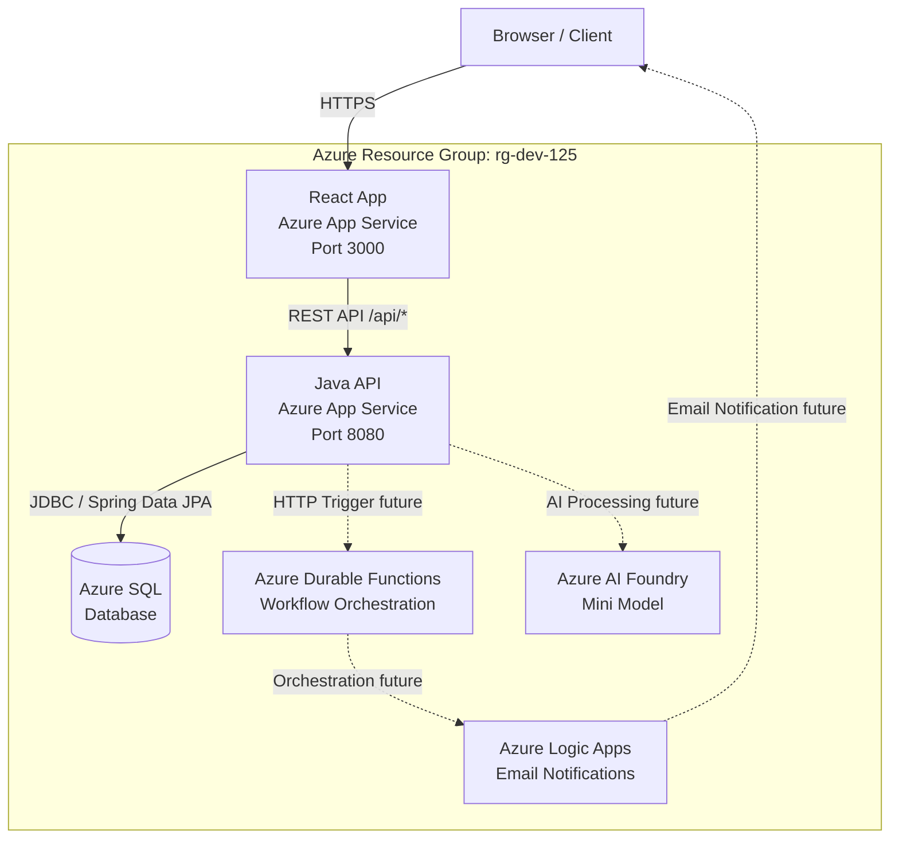

# Architecture Overview

## System Architecture Diagram

## Overview

The OPS Program Approval System follows a 3-tier architecture:

1. **Presentation Tier** — React 18 + TypeScript single-page application hosted on Azure App Service
2. **Application Tier** — Java 21 + Spring Boot 3.x REST API hosted on Azure App Service
3. **Data Tier** — Azure SQL database for persistent storage

All components are deployed within the Azure resource group `rg-dev-125`.

## Component Descriptions

| Component | Technology | Responsibility |
|-----------|------------|----------------|
| React App | React 18 + TypeScript + Vite | Citizen and Ministry portal UIs with Ontario Design System styling and bilingual EN/FR support |
| Java API | Java 21 + Spring Boot 3.x | RESTful API handling program submissions, reviews, and data validation |
| Azure SQL | Azure SQL Database (PaaS) | Persistent storage for programs, program types, and notifications |
| Durable Functions | Azure Durable Functions | Workflow orchestration for multi-step approval processes (future) |
| Logic Apps | Azure Logic Apps | Email notification delivery to citizens (future) |
| AI Foundry | Azure AI Foundry (Mini Model) | AI-powered processing and recommendations (future) |

## Data Flow

1. **Citizen submits a program** — fills out the submission form in the React application
2. **React sends POST request** — the frontend sends a `POST /api/programs` request to the Java API
3. **API validates and persists** — Spring Boot validates the request using Bean Validation and persists the program to Azure SQL via Spring Data JPA
4. **Ministry reviews the program** — a Ministry employee opens the internal review portal and views submitted programs
5. **API updates status** — the reviewer approves or rejects via `PUT /api/programs/{id}/review`, updating the status in Azure SQL
6. **Notification triggered** — a notification record is created for the citizen (future: delivered via Logic Apps)

## Security

- RBAC authentication for Ministry portal access (future integration)
- HTTPS enforced on all Azure App Service endpoints
- Input validation on all API endpoints using Bean Validation

## Future Integrations

The following components are shown in the architecture diagram but are not implemented in this demo iteration:

- **Azure Durable Functions** — orchestrate multi-step approval workflows
- **Azure Logic Apps** — send email notifications to citizens on status changes
- **Azure AI Foundry** — provide AI-powered recommendations for program classification
- **RBAC Authentication** — role-based access control for Ministry vs citizen portals

## Infrastructure

All Azure resources are pre-deployed in resource group `rg-dev-125` before the demo begins. The infrastructure includes:

- 2 Azure App Services (frontend and backend)
- 1 Azure SQL Database
- Azure Durable Functions, Logic Apps, and AI Foundry resources (provisioned but not wired in this demo)
