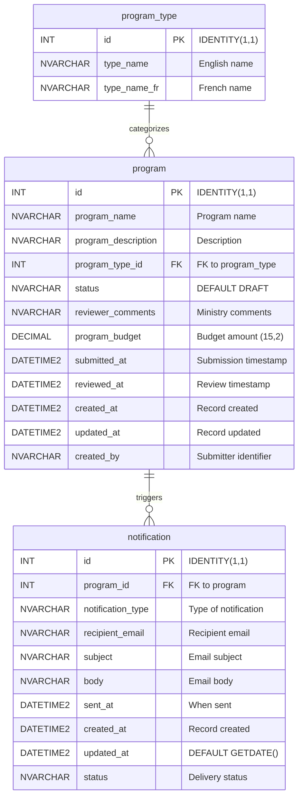

# Data Dictionary

## Entity Relationship Diagram

## Tables

### `program_type`

A static lookup table containing the types of programs citizens can submit. This table is seeded during deployment and does not require audit columns.

| Column Name | Data Type | Constraints | Description |
|-------------|-----------|-------------|-------------|
| `id` | `INT` | `PRIMARY KEY`, `IDENTITY(1,1)` | Auto-incrementing unique identifier |
| `type_name` | `NVARCHAR(100)` | `NOT NULL` | Program type name in English |
| `type_name_fr` | `NVARCHAR(100)` | `NOT NULL` | Program type name in French |

**Relationships**: One-to-many with `program` table via `program_type_id`

### `program`

The main transactional table storing citizen program submissions and their review status.

| Column Name | Data Type | Constraints | Description |
|-------------|-----------|-------------|-------------|
| `id` | `INT` | `PRIMARY KEY`, `IDENTITY(1,1)` | Auto-incrementing unique identifier |
| `program_name` | `NVARCHAR(200)` | `NOT NULL` | Name of the submitted program |
| `program_description` | `NVARCHAR(MAX)` | `NOT NULL` | Detailed description of the program |
| `program_type_id` | `INT` | `NOT NULL`, `FOREIGN KEY` | References `program_type(id)` |
| `status` | `NVARCHAR(20)` | `NOT NULL`, `DEFAULT 'DRAFT'` | Current workflow status |
| `reviewer_comments` | `NVARCHAR(MAX)` | `NULL` | Comments from the Ministry reviewer |
| `submitted_at` | `DATETIME2` | `NULL` | Timestamp when the citizen submitted |
| `reviewed_at` | `DATETIME2` | `NULL` | Timestamp when the Ministry reviewed |
| `created_at` | `DATETIME2` | `NOT NULL`, `DEFAULT GETDATE()` | Record creation timestamp |
| `updated_at` | `DATETIME2` | `NOT NULL`, `DEFAULT GETDATE()` | Last update timestamp |
| `created_by` | `NVARCHAR(100)` | `NOT NULL` | Identifier of the submitting citizen |
| `program_budget` | `DECIMAL(15,2)` | `NULL` | Optional budget amount for the program |

**Relationships**:
- Many-to-one with `program_type` via `program_type_id`
- One-to-many with `notification` via `program_id`

### `notification`

Stores notification records triggered by program status changes. Notifications are system-generated and do not include a `created_by` column.

| Column Name | Data Type | Constraints | Description |
|-------------|-----------|-------------|-------------|
| `id` | `INT` | `PRIMARY KEY`, `IDENTITY(1,1)` | Auto-incrementing unique identifier |
| `program_id` | `INT` | `NOT NULL`, `FOREIGN KEY` | References `program(id)` |
| `notification_type` | `NVARCHAR(50)` | `NOT NULL` | Type of notification (e.g., SUBMISSION_RECEIVED, APPROVED, REJECTED) |
| `recipient_email` | `NVARCHAR(200)` | `NOT NULL` | Email address of the notification recipient |
| `subject` | `NVARCHAR(500)` | `NOT NULL` | Email subject line |
| `body` | `NVARCHAR(MAX)` | `NOT NULL` | Email body content |
| `sent_at` | `DATETIME2` | `NULL` | Timestamp when the notification was sent |
| `created_at` | `DATETIME2` | `NOT NULL`, `DEFAULT GETDATE()` | Record creation timestamp |
| `updated_at` | `DATETIME2` | `NOT NULL`, `DEFAULT GETDATE()` | Last update timestamp |
| `status` | `NVARCHAR(20)` | `NOT NULL`, `DEFAULT 'PENDING'` | Delivery status (PENDING, SENT, FAILED) |

**Relationships**: Many-to-one with `program` via `program_id`

## Seed Data

The `program_type` table is seeded with the following 5 program types during initial deployment:

| id | type_name | type_name_fr |
|----|-----------|--------------|
| 1 | Community Services | Services communautaires |
| 2 | Health & Wellness | Santé et bien-être |
| 3 | Education & Training | Éducation et formation |
| 4 | Environment & Conservation | Environnement et conservation |
| 5 | Economic Development | Développement économique |

## Status Values

The `program.status` column uses these values to track the workflow state:

| Status | Description |
|--------|-------------|
| `DRAFT` | Initial state after citizen starts a submission |
| `SUBMITTED` | Citizen has finalized and submitted the program for review |
| `APPROVED` | Ministry reviewer has approved the program |
| `REJECTED` | Ministry reviewer has rejected the program |

## Migration Plan

Flyway versioned migrations create and seed the database schema:

| Migration | Description |
|-----------|-------------|
| `V001__create_program_type_table.sql` | Creates the `program_type` lookup table |
| `V002__create_program_table.sql` | Creates the `program` table with FK to `program_type` |
| `V003__create_notification_table.sql` | Creates the `notification` table with FK to `program` |
| `V004__seed_program_types.sql` | Seeds the 5 program types with EN/FR names |
| `V005__add_program_budget.sql` | Adds `program_budget` column to the `program` table |
